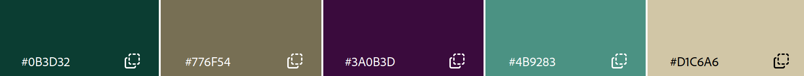

James Ostermiller
http://a1-jamesostermiller.onrender.com

This is a single-page site with basic information about my CS experience.

## Technical Achievements
- **CSS styling**:
    1. I applied my basic preferred stylings to all elements on the page (using border-box box-sizing, and removing default margins and padding to make custom styling easier)
    2. I made the body a flexbox so that it would automatically stretch the main content to fill the space left by the footer, and center both
    3. I made the main element take up 100% of the horizontal screen only up to a maximum width, so that on large screens it will appear as a central column with a reasonable reading width, and it also has a border around the content and allows the content to scroll within it
    4. I styled the details elements to have a border around each one (including between the border and summary) and a hover color over the summary to show that it's clickable. (I also tried using the nesting tags that were demonstrated in the reading for this, which isn't something I've done before)
    5. I styled all unordered lists to use the "comet" character as their bullet, with a larger font size to make it identifiable (which also provides for greater space between line items)
- **Semantic HTML tags**:
    - I used a `main` tag around the main content on my page
    - I used `details` and `summary` tags for the collapsible boxes
    - I used `button` tags to attach my functions to open/close all of the details boxes at once
    - I used the `footer` tag to put a link to the source code at the bottom of the page, outside of the main content border

## Design Achievements
- **Color palette**: I had 5 colors in my palette, which were used as the background, text color, background of the main boxes, button color, and hover color (see below image)
- **Google Fonts font**: I am using the google font "Major Mono Display" for the main heading.

No AI was used to complete this assignment.